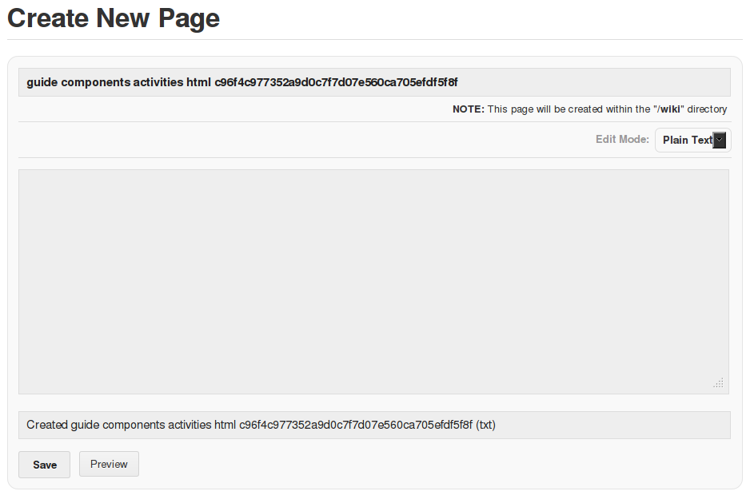
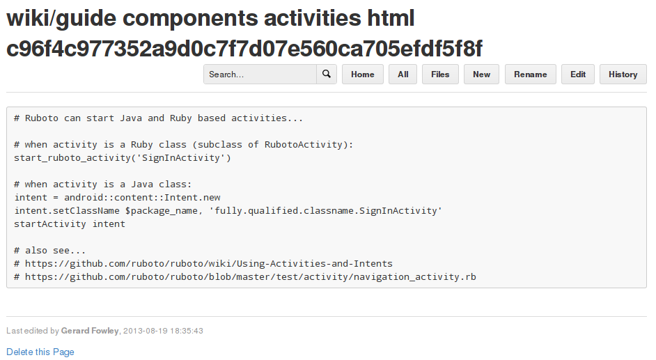
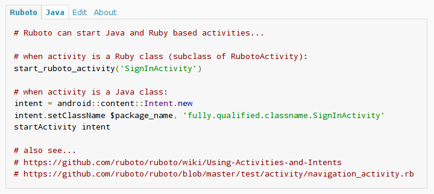
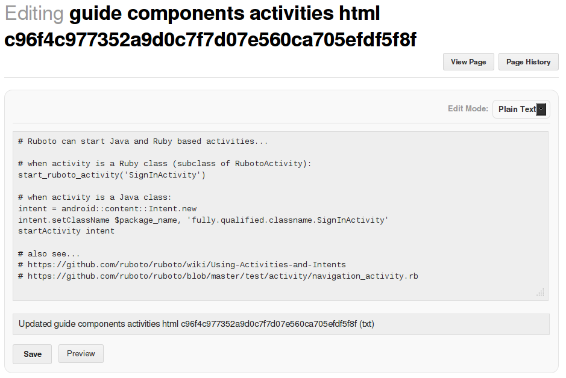

# Android Ruboto Documentation

[Ruboto](http://ruboto.org/) code examples for [Google Android developer documentation](http://developer.android.com/develop). Presented in context while browsing Google Android developer documentation at http://developer.android.com/develop.

## Description

This is a browser-based user-script implemented with the [GreaseMonkey](http://www.greasespot.net/) Firefox add-on. Currently works with Firefox only, at this stage user-script incompatibilities prevent operation with Chrome.

## Installation

0. Start [Firefox](http://www.mozilla.org/firefox).
0. Install the GreaseMonkey Firefox [add-on](https://addons.mozilla.org/en-US/firefox/addon/greasemonkey/).
0. Download the Android Ruboto Documentation [user-script](https://android-ruboto-doc.iqeo.net/android_ruboto_doc.user.js).
0. Firefox will ask to confirm installation, click Install.

## Update

As this project develops it may be necessary to update the user-script. This is an automatic process, only requiring user confirmation when an update is available. The GreaseMonkey secure update protocol ensures that updates will only be installed from the original (SSL certificate authenticated) source at the project site https://android-ruboto-doc.iqeo.net.

## Removal

0. Open the Firefox Add-Ons Manager (accessible from the Firefox menu).
0. Select the GreaseMonkey User Scripts tab.
0. Select and disable or remove this script.
0. Optionally uninstall the GreaseMonkey add-on from the Firefox Add-Ons Manager. 

## Usage

Browse to the Google Android developer documentation at http://developer.android.com/develop.

### Original examples

With this script disabled or not installed, examples in the documentation are normally presented:

> 

### Examples without Ruboto doc 
With this script active, examples will look like this when there is no corresponding Ruboto example:

> 

Click the 'create' link to create a Ruboto example at the Android Ruboto Documentation wiki:

> 

_Do not change the page title, this is required to associate with the original Java example._  
Create the Ruboto example (see [documentation guidelines](#documentation-guidelines)) and save it:

> 

Refresh the orginal developer.android.com page to see the newly created Ruboto example in context.

### Examples with Ruboto doc
With this script active, Ruboto examples are presented on the Ruboto tab:

> 

Click the 'Edit' link to edit the Ruboto example at the Android Ruboto Documentation wiki:
> 

_Do not change the page title, this is required to associate with the original Java example._  
Edit the Ruboto example (see [documentation guidelines](#documentation-guidelines)) and save it:

> 

Refresh the orginal developer.android.com page to see the newly created Ruboto example in context.

### Original Java doc
The original Java example can be seen on the Java tab:

> 

## Wiki Pages
All pages in the documentation are available at the [wiki](https://android-ruboto-doc.iqeo.net/pages).  
This document and link are also accessible from the 'about' link above examples in context.

## Documentation Guidelines

Ideally, Ruboto code examples...

* Consist entirely of valid Ruby code, with non-code text; comments, links, etc.. in comments ```#...``` or ```=begin;=end``` blocks.
* Where possible, are directly equivalent to the corresponding Java code example to permit easy comparison of Java and Ruboto code.
* Provide the simplest solution utilizing Ruboto best-practices (yes.. that's currently a moving target).
* Where appropriate, provide relevant Ruboto coding alternatives.
* May provide links in comments to Ruboto tutorials, code, explanations, etc.. relevant to the example.
* Are _not_ copies of the Java example when the Ruboto example would be identical, instead consist of a comment ```# No changes required for Ruboto```.

## Documentation License

<a rel="license" href="http://creativecommons.org/licenses/by-sa/3.0/deed.en_US"></a><br /><span xmlns:dct="http://purl.org/dc/terms/" href="http://purl.org/dc/dcmitype/Text" property="dct:title" rel="dct:type">Contributed documentation</span> is licensed under a <a rel="license" href="http://creativecommons.org/licenses/by-sa/3.0/deed.en_US">Creative Commons Attribution-ShareAlike 3.0 Unported License</a>.

If author attribution is desired, provide the author's name and/or email address in a comment ```#...``` at the end of the example.

## Project License

This project (not including contributed documentation) is licensed under [GPLv3](http://www.gnu.org/licenses/gpl.html).
